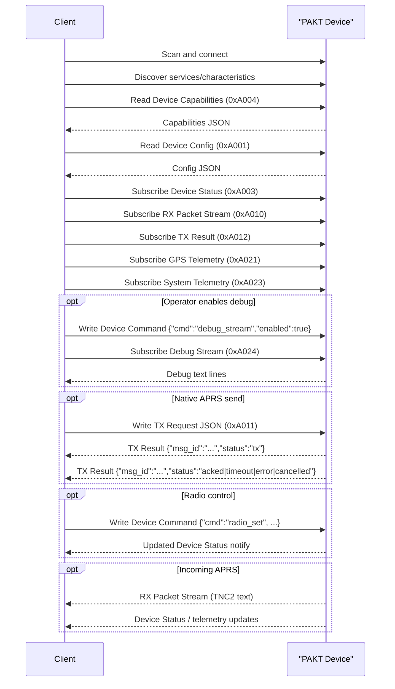

# PAKT BLE API / Protocol Reference

Date: 2026-03-28
Status: active API/protocol reference for desktop, iPhone, and future third-party integrations.

## Protocol Revision

- Protocol family: `PAKT native BLE + KISS-over-BLE`
- Protocol revision: `1`
- Document revision: `2026-03-28`

Revision meaning:
- `protocol revision` is the compatibility marker exposed to clients through
  `Device Capabilities`
- additions that preserve existing UUIDs, payload keys, and semantics may keep
  the same protocol revision
- breaking changes to UUIDs, required payload fields, chunk framing, or message
  semantics must increment the protocol revision and be called out explicitly

Current compatibility expectation for revision `1`:
- UUIDs in this document are stable
- JSON field names in this document are stable
- native PAKT BLE and KISS-over-BLE coexist
- chunk header format remains `msg_id | chunk_idx | chunk_total`

## Purpose

This document is the integration-grade API/protocol reference for the PAKT BLE interface.
It consolidates:
- GATT services and characteristic UUIDs
- characteristic properties and security requirements
- JSON and text payload contracts
- chunking and framing rules
- command semantics
- integration expectations for client software and companion hardware

Use this as the first-stop BLE protocol reference for:
- desktop clients
- iPhone clients
- external bridges
- hardware/software interoperability work

This document is intended to be usable on its own by another team integrating with
the device. The linked specs remain authoritative for deep detail, but this file
is the main external-facing reference.

Agent-friendly quick reference:
- [BLE Protocol Quick Reference For Agents](/Users/macmini4/Desktop/PAKT/docs/aprs_mvp_docs/agent_bootstrap/ble_protocol_quickref.md)

This document does not replace the deeper source specs; it organizes them into
one practical reference:
- [05_ble_gatt_spec.md](/Users/macmini4/Desktop/PAKT/docs/aprs_mvp_docs/docs/05_ble_gatt_spec.md)
- [payload_contracts.md](/Users/macmini4/Desktop/PAKT/docs/aprs_mvp_docs/payload_contracts.md)
- [16_kiss_over_ble_spec.md](/Users/macmini4/Desktop/PAKT/docs/aprs_mvp_docs/docs/16_kiss_over_ble_spec.md)

## How To Think About This Document

There is no single universal industry standard for a document exactly like this,
but the closest common patterns are:
- a **BLE GATT profile specification**
- an **Interface Control Document (ICD)**
- an **API / protocol reference**

For this project, the right model is:
- Bluetooth SIG style for services/characteristics/properties/security
- plus an ICD-style contract for payloads, framing, and behavior

Normative language in this document:
- **must** = required for interoperability
- **should** = recommended for robust integration
- **may** = optional behavior

## Protocol Scope

PAKT exposes two BLE-facing protocols at the same time:
- the **native PAKT BLE protocol** for configuration, telemetry, APRS messaging, status, and debug
- **KISS-over-BLE** for third-party APRS/TNC compatibility

These are intentionally **non-modal**:
- native PAKT BLE and KISS may coexist
- clients do not need to switch the device into a dedicated KISS mode

## Versioning And Authority

- Base UUID authority: [BleUuids.h](/Users/macmini4/Desktop/PAKT/firmware/components/ble_services/include/pakt/BleUuids.h)
- JSON payload authority: [payload_contracts.md](/Users/macmini4/Desktop/PAKT/docs/aprs_mvp_docs/payload_contracts.md)
- KISS framing authority: [16_kiss_over_ble_spec.md](/Users/macmini4/Desktop/PAKT/docs/aprs_mvp_docs/docs/16_kiss_over_ble_spec.md)
- This file is the consolidated integration reference, not the canonical generator of UUIDs or schemas

## Base UUID

All custom services and characteristics use this base UUID:

- `544E4332-8A48-4328-9844-3F5C00000000`

Rule:
- insert the 16-bit service or characteristic id into the `0000` field before the last group

Example:
- `0xA001` -> `544E4332-8A48-4328-9844-3F5CA0010000`

## Security Model

Read/notify endpoints:
- may be readable or subscribable without encryption unless otherwise noted

Write-capable control endpoints:
- must require an encrypted BLE link
- current project intent is encrypted + bonded access for production control writes

Relevant write endpoints:
- `Device Config`
- `Device Command`
- `TX Request`
- `KISS TX`

Clients should surface authentication failures clearly as:
- pairing required
- encryption required
- bond/reconnect may be required

## Quick Integration Checklist

A new client integration should do the following:

1. Connect and discover all services.
2. Read `Device Capabilities`.
3. Read `Device Config`.
4. Subscribe to:
   - `Device Status`
   - `RX Packet Stream`
   - `TX Result`
   - `GPS Telemetry`
   - `System Telemetry`
5. Subscribe to `Power Telemetry` if used by the client.
6. Subscribe to `Debug Stream` only when the operator enables debug mode.
7. Use `TX Request` for native APRS send flow.
8. Use `Device Command` for one-shot control (`radio_set`, `debug_stream`, `beacon_now`).
9. Use `KISS TX`/`KISS RX` only if the capability record advertises `kiss_ble`.
10. Handle auth failures, reconnect, and chunk reassembly explicitly.

## Reference Session Flow



## Services Overview

The device exposes:

1. Device Information Service
2. APRS Service
3. Device Telemetry Service
4. KISS Service

## Service And Characteristic Map

### 1. Device Information Service

Standard BLE service:
- service: `0x180A`

Characteristics:

| Name | UUID | Properties | Format |
|---|---|---|---|
| Manufacturer Name | `0x2A29` | Read | UTF-8 text |
| Model Number | `0x2A24` | Read | UTF-8 text |
| Firmware Revision | `0x2A26` | Read | UTF-8 text |

### 2. APRS Service

- service id: `0xA000`
- full UUID: `544E4332-8A48-4328-9844-3F5CA0000000`

| Characteristic | ID | Full UUID | Properties | Payload Type | Security |
|---|---|---|---|---|---|
| Device Config | `0xA001` | `544E4332-8A48-4328-9844-3F5CA0010000` | Read, Write | JSON | encrypted/bonded for write |
| Device Command | `0xA002` | `544E4332-8A48-4328-9844-3F5CA0020000` | Write Without Response | JSON | encrypted/bonded |
| Device Status | `0xA003` | `544E4332-8A48-4328-9844-3F5CA0030000` | Notify | JSON | subscribe |
| Device Capabilities | `0xA004` | `544E4332-8A48-4328-9844-3F5CA0040000` | Read | JSON | none |
| RX Packet Stream | `0xA010` | `544E4332-8A48-4328-9844-3F5CA0100000` | Notify | UTF-8 text | subscribe |
| TX Request | `0xA011` | `544E4332-8A48-4328-9844-3F5CA0110000` | Write | JSON | encrypted/bonded |
| TX Result | `0xA012` | `544E4332-8A48-4328-9844-3F5CA0120000` | Notify | JSON | subscribe |

### 3. Device Telemetry Service

- service id: `0xA020`
- full UUID: `544E4332-8A48-4328-9844-3F5CA0200000`

| Characteristic | ID | Full UUID | Properties | Payload Type |
|---|---|---|---|---|
| GPS Telemetry | `0xA021` | `544E4332-8A48-4328-9844-3F5CA0210000` | Notify | JSON |
| Power Telemetry | `0xA022` | `544E4332-8A48-4328-9844-3F5CA0220000` | Notify | JSON |
| System Telemetry | `0xA023` | `544E4332-8A48-4328-9844-3F5CA0230000` | Notify | JSON |
| Debug Stream | `0xA024` | `544E4332-8A48-4328-9844-3F5CA0240000` | Notify | UTF-8 text |

### 4. KISS Service

- service id: `0xA050`
- full UUID: `544E4332-8A48-4328-9844-3F5CA0500000`

| Characteristic | ID | Full UUID | Properties | Payload Type | Security |
|---|---|---|---|---|---|
| KISS RX | `0xA051` | `544E4332-8A48-4328-9844-3F5CA0510000` | Notify | binary KISS | subscribe |
| KISS TX | `0xA052` | `544E4332-8A48-4328-9844-3F5CA0520000` | Write With Response | binary KISS | encrypted/bonded |

## Characteristic Behavior

### Device Config

Purpose:
- persistent operator identity/config

Write schema:

```json
{
  "callsign": "W1AW",
  "ssid": 9
}
```

Constraints:
- `callsign`: `1-6` chars, APRS-safe callsign content
- `ssid`: `0-15`

Read behavior:
- returns the current persisted config

Write result:
- accepted config becomes the new device identity baseline
- invalid writes must be rejected

### Device Command

Purpose:
- one-shot commands and runtime control that should not be modeled as persisted config

Supported command families:

1. Debug stream toggle

```json
{
  "cmd": "debug_stream",
  "enabled": true
}
```

2. Radio control

```json
{
  "cmd": "radio_set",
  "rx_freq_hz": 144390000,
  "tx_freq_hz": 144390000,
  "squelch": 1,
  "volume": 4,
  "wide_band": true
}
```

Supported `radio_set` fields:
- `freq_hz`
- `rx_freq_hz`
- `tx_freq_hz`
- `squelch`
- `volume`
- `wide_band`

3. One-shot beacon

```json
{
  "cmd": "beacon_now"
}
```

Rules:
- payload must be valid JSON
- `cmd` is required
- malformed or unsupported commands must be rejected safely
- integrations must not assume any write succeeded silently; they should confirm via
  status, subsequent reads, or observed device behavior when relevant

### Device Status

Purpose:
- compact runtime dashboard state for app clients

Example:

```json
{
  "radio": "idle",
  "bonded": true,
  "encrypted": true,
  "gps_fix": true,
  "pending_tx": 0,
  "rx_queue": 0,
  "rx_freq_hz": 144390000,
  "tx_freq_hz": 144390000,
  "squelch": 1,
  "volume": 4,
  "wide_band": true,
  "debug_enabled": false,
  "uptime_s": 3600
}
```

Fields:
- `radio`: `idle | tx | rx | error | unknown`
- `bonded`: bool
- `encrypted`: bool
- `gps_fix`: bool
- `pending_tx`: int
- `rx_queue`: int
- `rx_freq_hz`: int
- `tx_freq_hz`: int
- `squelch`: int
- `volume`: int
- `wide_band`: bool
- `debug_enabled`: bool
- `uptime_s`: int

### Device Capabilities

Purpose:
- capability negotiation for clients

Example:

```json
{
  "fw_ver": "0.1.0",
  "hw_rev": "EVT-A",
  "protocol": 1,
  "features": [
    "aprs_2m",
    "ble_chunking",
    "telemetry",
    "msg_ack",
    "config_rw",
    "gps_onboard",
    "kiss_ble"
  ]
}
```

Integration rule:
- clients should read capabilities on connect
- optional behaviors should be gated from this payload rather than assumed

### RX Packet Stream

Purpose:
- live APRS receive feed for native PAKT clients

Format:
- UTF-8 TNC2 monitor text

Example:

```text
W1AW-9>APRS,WIDE1-1:>PAKT v0.1
```

### TX Request

Purpose:
- native structured APRS message send path

Example:

```json
{
  "dest": "APRS",
  "text": "Hello World",
  "ssid": 0
}
```

Fields:
- `dest`: destination callsign-like field
- `text`: APRS payload text
- `ssid`: optional destination SSID

Behavior:
- a valid request enters the firmware TX/message path
- result state is reported asynchronously on `TX Result`

### TX Result

Purpose:
- native TX lifecycle result feed

Example:

```json
{
  "msg_id": "42",
  "status": "acked"
}
```

Allowed `status` values:
- `tx`
- `acked`
- `timeout`
- `cancelled`
- `error`

Integration rule:
- `tx` is not terminal
- `acked`, `timeout`, `cancelled`, and `error` are terminal states

### GPS Telemetry

Purpose:
- app-visible GPS state

Example:

```json
{
  "lat": 43.8130,
  "lon": -79.3943,
  "alt_m": 75.0,
  "speed_kmh": 11.1,
  "course": 54.7,
  "sats": 8,
  "fix": 1,
  "ts": 764426119
}
```

Important:
- `fix=0` is a valid “alive but not fixed” state
- this is important for app UX and integration diagnostics

### Power Telemetry

Purpose:
- power/battery runtime reporting

Example:

```json
{
  "batt_v": 3.95,
  "batt_pct": 72,
  "tx_dbm": 30.0,
  "vswr": 1.3,
  "temp_c": 34.5
}
```

### System Telemetry

Purpose:
- runtime health/status counters

Example:

```json
{
  "free_heap": 145000,
  "min_heap": 112000,
  "cpu_pct": 17,
  "tx_pkts": 42,
  "rx_pkts": 11,
  "tx_errs": 0,
  "rx_errs": 1,
  "uptime_s": 1800
}
```

### Debug Stream

Purpose:
- operator-facing runtime debug output over BLE

Format:
- UTF-8 text lines, one logical line per notify payload

Example:

```text
[radio] radio_set rx=144390000 tx=144390000 squelch=1 volume=4 wide=true
```

Rules:
- disabled by default
- enabled by `Device Command`
- should carry scoped human-readable diagnostics, not a mirror of all ESP logs
- integrations should treat this as session/debug data, not as a stable machine-readable API

### KISS RX / KISS TX

Purpose:
- third-party APRS/TNC interoperability

Rules:
- KISS is binary, not JSON
- port `0` only for MVP
- native PAKT BLE and KISS are non-modal and may coexist

See:
- [16_kiss_over_ble_spec.md](/Users/macmini4/Desktop/PAKT/docs/aprs_mvp_docs/docs/16_kiss_over_ble_spec.md)

## Chunking And Framing

Chunking is used when a logical payload does not fit comfortably in one BLE ATT payload.

Current chunk header:
- `msg_id:1`
- `chunk_idx:1`
- `chunk_total:1`

Used by:
- native large JSON writes where applicable
- KISS RX
- KISS TX

Chunk layout:

| Byte | Field | Meaning |
|---|---|---|
| 0 | `msg_id` | logical message identifier |
| 1 | `chunk_idx` | zero-based chunk number |
| 2 | `chunk_total` | total chunks in message |
| 3..n | payload | chunk payload bytes |

Integration expectations:
- client must support reassembly
- client must tolerate duplicate chunks
- client must enforce timeout/eviction of incomplete messages
- negotiated MTU should be increased when possible, but the protocol must still work at default MTU

## Recommended Client Session Flow

1. Scan for the PAKT peripheral.
2. Connect.
3. Discover services/characteristics.
4. Read:
   - Device Capabilities
   - Device Config
5. Subscribe to:
   - Device Status
   - RX Packet Stream
   - TX Result
   - GPS Telemetry
   - System Telemetry
   - optionally Power Telemetry
6. Subscribe to Debug Stream only when the user explicitly enables debug mode.
7. For KISS-capable clients, subscribe to KISS RX and use KISS TX only if the device advertises `kiss_ble`.

## Error Handling Expectations

Client integrations should handle these classes of errors cleanly:
- authentication failure on write
- malformed payload rejection
- unsupported command rejection
- dropped or incomplete chunked payload
- reconnect and re-subscribe flow after link loss

User-facing apps should distinguish:
- not paired / not encrypted
- command rejected
- transport disconnected
- no GPS fix yet
- no APRS packets yet

## Integration Notes For Hardware/Embedded Peers

If another embedded device or bridge integrates with PAKT over BLE, it should:
- treat this document as the wire/protocol contract
- preserve UUIDs exactly
- preserve JSON keys exactly
- preserve KISS framing exactly
- avoid depending on debug stream text format for machine logic
- use `Device Capabilities` to gate optional behavior instead of guessing

## Conformance Checklist For Third-Party Integrators

A third-party integration should be considered conformant when it does all of the following:

- discovers and uses the UUIDs in this document without remapping or aliasing them
- reads `Device Capabilities` before enabling optional features
- reads `Device Config` successfully
- subscribes to at least:
  - `Device Status`
  - `RX Packet Stream`
  - `TX Result`
- correctly parses native JSON payloads using the documented field names
- treats `RX Packet Stream` as UTF-8 TNC2 text, not JSON
- treats `Debug Stream` as UTF-8 text, not JSON
- uses `TX Request` for native APRS send and handles asynchronous `TX Result`
- enforces/reports authentication requirements on write failures
- supports reconnect and re-subscribe after link loss
- supports chunk reassembly where required
- if KISS is implemented:
  - checks `kiss_ble` capability first
  - uses KISS service UUIDs exactly
  - preserves KISS binary framing and escaping exactly

Recommended validation evidence:
- successful connect/read/subscribe session
- at least one received APRS packet shown correctly
- at least one transmitted APRS request with terminal `TX Result`
- one successful `radio_set` command round-trip
- one debug-stream enable/disable session

## Compatibility Rules

Any future integration should preserve:
- UUID stability
- existing JSON field names
- existing TX result semantics
- native/KISS coexistence
- debug stream as a separate channel, not mixed into status or RX packet flow

If a new integration needs protocol changes:
- update firmware
- update the desktop client
- update the iPhone client
- update:
  - [05_ble_gatt_spec.md](/Users/macmini4/Desktop/PAKT/docs/aprs_mvp_docs/docs/05_ble_gatt_spec.md)
  - [payload_contracts.md](/Users/macmini4/Desktop/PAKT/docs/aprs_mvp_docs/payload_contracts.md)
  - this document

## Best Practice For Future Reuse

If this protocol is reused in another device or software stack, treat this file as the
high-level ICD and keep three layers separate:
- **transport/profile**: services, UUIDs, security, MTU, chunking
- **payload contracts**: exact JSON/text/binary shapes
- **behavioral rules**: sequencing, retries, coexistence, and error handling

That split is the most portable structure for cross-team and cross-platform integration work.
