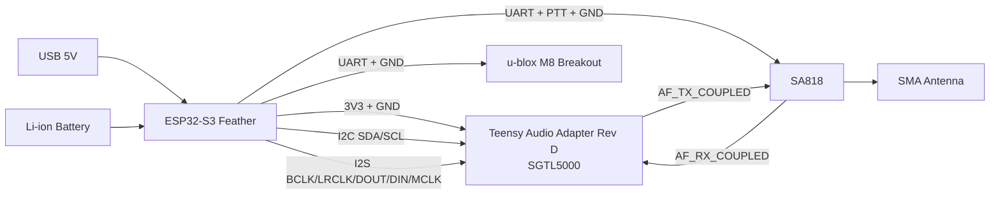

# Prototype Breakout Wiring Plan (ESP32-S3 Feather + Teensy Audio Rev D + SA818 + u-blox M9N)

This document is the prototype harness baseline for your selected stack:
- MCU: Adafruit ESP32-S3 Feather 4MB Flash / 2MB PSRAM
- Audio codec board: Teensy Audio Adapter Rev D (SGTL5000)
- RF module: SA818 breakout/module
- GPS: u-blox M9N breakout board

Goal:
- Use one wiring plan for prototype bring-up and later PCB migration.
- Keep firmware pin mapping stable between proto and PCB.
- Keep bench validation aligned with `docs/bench_bringup_checklist.md` and record values in `docs/bench_measured_values_template.md`.

## 1. Sources consulted

Project-local references:
- `hardware/prototyping_wiring.md`
- `hardware/component_selection_rationale.md`
- `docs/aprs_mvp_docs/hardware/interfaces.md`
- `docs/hardware/components/esp32-s3/sources.md`
- `docs/hardware/components/sa818/sources.md`
- `docs/hardware/components/neo-m8n/sources.md`
- `docs/hardware/components/sgtl5000/sources.md`

Notes:
- This repo does not contain local PDFs for all breakout board schematics. It stores authoritative source links and requires schematic verification against your exact board revision before freezing the harness.
- The electrical plan below follows the existing project net conventions and SGTL5000/SA818/GPS architecture already used in firmware docs.

## 2. Architecture wiring diagram

## 3. Pin map (prototype harness)

Use this mapping as the current bench harness map for the Adafruit Feather ESP32-S3. It replaces the earlier draft pinout and should stay aligned with firmware during bring-up.

### 3.1 I2C control bus
| Feather GPIO | Net | Connects to |
|---|---|---|
| GPIO3 | I2C_SDA | SGTL5000 SDA (Teensy Audio), optional other I2C peripherals |
| GPIO4 | I2C_SCL | SGTL5000 SCL (Teensy Audio), optional other I2C peripherals |

Requirements:
- One pull-up set only on the bus (typ 2.2k to 4.7k to 3.3V).
- If breakouts already include pull-ups, remove/disable extras where possible.
- If relying on the Feather's onboard pull-ups, make sure the board's I2C pull-up power path is enabled during bring-up.
- Bench-verified bus members on the current harness are `SGTL5000 @ 0x0A`, `MAX17048 @ 0x36`, and `u-blox M9N @ 0x42`.
- Important bring-up finding: the SGTL5000 appears on I2C only after `SYS_MCLK` is active, so firmware must enable I2S/MCLK before codec configuration.
- Bench-verified behavior: after MCLK is active, the SGTL5000 initializes cleanly at `0x0A` and the headphone output test is audible on the PJRC 3.5 mm jack.

### 3.2 I2S digital audio bus (ESP32 master)
| Feather GPIO | Net | Teensy Audio Rev D / SGTL5000 signal |
|---|---|---|
| GPIO8 | I2S_BCLK | BCLK / SCLK |
| GPIO15 | I2S_WS | LRCLK / WS |
| GPIO12 | I2S_DOUT | DIN (codec data input from MCU) |
| GPIO10 | I2S_DIN | DOUT (codec data output to MCU) |
| GPIO14 | I2S_MCLK | MCLK / SYS_MCLK |

Requirements:
- Keep these wires short and grouped with adjacent ground returns.
- Add optional 22 to 47 ohm series resistors at MCU side if edges ring on long jumper harnesses.
- Bench-verified audio bring-up now succeeds with `GPIO14` supplying `SYS_MCLK` before SGTL5000 I2C init.
- Bench-verified digital audio format for the PJRC board is 16-bit stereo Philips I2S with both channels driven during headphone test.
- Current audio-first bench remap uses `GPIO15` for `I2S_WS`; before wiring the SA818 stage, reassign the radio UART plan so the nets do not overlap.

### 3.3 UARTs and control
| Function | Feather GPIO | Net | Remote signal |
|---|---|---|---|
| GPS TX | GPIO17 | GPS_RX_CTRL | u-blox M9N RXD |
| GPS RX | GPIO18 | GPS_TX_NMEA | u-blox M9N TXD |
| Radio TX | GPIO13 | SA818_RX_CTRL | SA818 RXD |
| Radio RX | GPIO9  | SA818_TX_STAT | SA818 TXD |
| PTT | GPIO11 | SA818_PTT | SA818 PTT |

Optional:
- GPS PPS -> one spare interrupt-capable GPIO (for time sync diagnostics).

## 4. Analog audio interconnect (codec <-> SA818)

| Source | Destination | Net | Prototype conditioning |
|---|---|---|---|
| SGTL5000 line out / DAC out | SA818 AF_IN | AF_TX_COUPLED | AC coupling cap + attenuation pad option |
| SA818 AF_OUT | SGTL5000 line in / ADC in | AF_RX_COUPLED | AC coupling cap + optional RC low-pass |

Recommended starting network (tune during bench calibration):
- AF_TX path: 1 uF AC coupling capacitor in series, plus resistor divider footprint (for TX deviation tuning).
- AF_RX path: 1 uF AC coupling capacitor in series; optional RC footprint (for example 10k/10nF) for high-frequency noise trim.
- Operator note from bench testing: the PJRC 3.5 mm jack is output-only for this setup; use the separate `LINE_IN` header for injected input testing.

Bench-verified usage before SA818 hookup:
- Headphone verification: standard `TRS` headphones into the PJRC 3.5 mm jack.
- Input verification: line-level signal into PJRC `LINE_IN` header.
- Project-appropriate SGTL5000 receive path for SA818 is `LINE_IN`, not `MIC_IN`.

## 5. Power and grounding guidance (important for SA818 reliability)

### 5.1 Rail strategy
- Keep Feather onboard battery/charger path as your prototype baseline.
- For this prototype, battery management/charging is provided by the Feather board (no external charger/fuel-gauge wiring required).
- Feed SA818 from a dedicated radio rail branch with local bulk capacitance.
- Keep codec on clean 3.3V domain; optionally add ferrite bead from digital 3.3V to analog codec rail.

### 5.2 Minimum decoupling on prototype harness
- SA818 supply entry: 100 nF + 10 uF + extra bulk (start with 220 to 470 uF low-ESR near module).
- SGTL5000 board supply: verify local decoupling is populated on Teensy Audio board; add local 10 uF on harness if leads are long.
- GPS breakout: 100 nF close to module VIN/VCC if breakout does not already provide enough local decoupling.

### 5.3 Grounding
- Use a star-like return concept in proto wiring: separate SA818 high-current return path from codec analog return as much as practical.
- Run at least one dedicated ground wire alongside each signal bundle (I2S/UART/audio).

## 6. Protection and support components to include now (so PCB reuse is easy)

Add these in prototype harness or as inline adapter boards where practical:
- PTT stage option: transistor driver footprint/path (NPN or NMOS) with pull resistor, in case direct GPIO drive is noisy or polarity-sensitive.
- USB and external connector ESD protection (especially if antenna/debug jacks are user-exposed).
- Reverse polarity and inrush strategy for battery path (if using external battery connectors in proto).
- Optional ferrite bead and extra bulk pad locations on radio rail.
- Test points or accessible clip points for: V_SYS_3V3, V_RADIO, AF_TX_COUPLED, AF_RX_COUPLED, SA818_PTT.

## 7. Breakout schematic checks to perform before freezing

Because breakout revisions vary, confirm the following on each exact board revision you own:

1. ESP32-S3 Feather
- Confirm each required GPIO is actually broken out to a header pad.
- Confirm no boot-strapping conflict on selected pins.
- Confirm battery/charger behavior for expected TX burst load profile.

2. Teensy Audio Adapter Rev D
- Confirm SGTL5000 pins exposed and naming for MCLK/BCLK/LRCLK/DIN/DOUT/SDA/SCL.
- Confirm board logic voltage and pull-up population.
- Confirm line-in/line-out reference level and coupling expectations.
- Preserve the working SGTL5000 setup found during bench bring-up:
  - `CHIP_I2S_CTRL = 0x0030`
  - `CHIP_SSS_CTRL = 0x0010`
  - `CHIP_ANA_CTRL = 0x0006`
  - `CHIP_SHORT_CTRL = 0x4446`
  - final `CHIP_ANA_POWER = 0x40FF`

3. SA818 breakout/module
- Confirm supply voltage range, TX burst current, and logic input thresholds.
- Confirm PTT polarity and default state.
- Confirm AF input/output nominal levels.

4. u-blox M9N breakout
- Confirm UART voltage level compatibility with 3.3V logic.
- Confirm onboard regulator/input voltage expectations (3.3V vs 5V VIN).
- Confirm availability of PPS pin if you plan to use it.

## 8. Firmware-to-hardware continuity notes

Keep these net names and GPIO assignments aligned in firmware config for direct proto->PCB reuse:
- I2C: `I2C_SDA`, `I2C_SCL`
- I2S: `I2S_BCLK`, `I2S_WS`, `I2S_DOUT`, `I2S_DIN`, `I2S_MCLK`
- Radio: `SA818_PTT`, `SA818_RX_CTRL`, `SA818_TX_STAT`
- GPS: `GPS_TX_NMEA`, `GPS_RX_CTRL`, optional `GPS_PPS`
- Audio: `AF_TX_COUPLED`, `AF_RX_COUPLED`

## 9. Bring-up sequence for this prototype stack

1. Power-only smoke test (Feather + rails, no SA818 TX).
2. Bring up I2S/MCLK first, then verify SGTL5000 appears on I2C at `0x0A`.
3. Confirm `MAX17048 @ 0x36` and `u-blox M9N @ 0x42` remain visible on the shared bus.
4. Run the headphone bench test and verify audible left/right/both-channel tones on the PJRC 3.5 mm jack.
5. If needed, inject a line-level signal into `LINE_IN` and verify input monitor / passthrough before attaching SA818.
6. SA818 UART command test on `GPIO13/GPIO9` and verify `AT+DMOCONNECT` response.
7. Program SA818 to `144.390 MHz` with `AT+DMOSETGROUP` and confirm acceptance.
8. Run the short PTT polarity test on `GPIO11` and visually verify the SA818 TX indication.
9. Run the RX-audio window with `AF_OUT -> LINE_IN` and verify non-zero monitor levels with an on-frequency source.
10. Run the short supervised TX-audio tone test with a dummy load or proper antenna attached.
11. GPS NMEA lock and UART stability.
12. Full APRS path with repeated TX while monitoring resets/brownout.

## 10. Open items before PCB capture

- Capture exact breakout board schematic revisions (PDFs) into `docs/hardware/components/...` for traceable signoff.
- Replace any provisional component-level assumptions with measured bench values (AF attenuation/filter values, radio bulk capacitance, PTT drive topology).
- Record measured SA818 deviation and received AF levels from the now-working bench harness.
- Freeze final pin map only after confirming chosen Feather GPIOs are conflict-free for boot and runtime.
