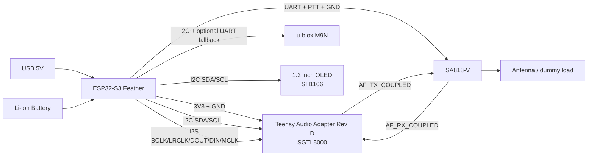

# Prototype Breakout Wiring Plan

Bench stack:
- Adafruit ESP32-S3 Feather family, `4 MB flash / 2 MB PSRAM` power-reference baseline
- Teensy Audio Adapter Rev D (`SGTL5000`)
- `SA818-V`
- u-blox `M9N`
- `1.3 inch IIC v2.0` OLED display with `SH1106` controller on the default I2C bus

Goal:
- Use one wiring plan for prototype bring-up and later PCB migration.
- Keep firmware pin mapping stable between proto and PCB.
- Keep the custom PCB power section aligned with the Adafruit ESP32-S3 Feather with `4MB Flash / 2MB PSRAM` bench behavior.
- Keep bench validation aligned with `docs/bench_bringup_checklist.md` and record values in `docs/bench_measured_values_template.md`.

## 1. Sources consulted
- `hardware/prototyping_wiring.md`
- `hardware/component_selection_rationale.md`
- `docs/aprs_mvp_docs/hardware/interfaces.md`
- `docs/hardware/components/esp32-s3/sources.md`
- `docs/hardware/components/sa818/sources.md`
- `docs/hardware/components/neo-m8n/sources.md`
- `docs/hardware/components/sgtl5000/sources.md`
- `docs/hardware/components/max17048/sources.md`
- `docs/hardware/components/mcp73831/sources.md`

Notes:
- This repo stores authoritative source links and the Adafruit Feather reference repos used for the battery subsystem.
- The electrical plan below follows the confirmed project net conventions and the bench-proven SGTL5000/SA818/GPS architecture already used in firmware.

## 2. Architecture wiring diagram

## 3. Pin map

### 3.1 I2C control bus
| Feather GPIO | Net | Connects to |
|---|---|---|
| GPIO3 | `I2C_SDA` | SGTL5000 SDA, MAX17048 SDA, GPS SDA, SH1106 SDA |
| GPIO4 | `I2C_SCL` | SGTL5000 SCL, MAX17048 SCL, GPS SCL, SH1106 SCL |

Requirements:
- One pull-up set only on the bus.
- Bench bus members now include `SGTL5000 @ 0x0A`, `MAX17048 @ 0x36`, `u-blox M9N @ 0x42`, and the SH1106 display at the module's fitted address, typically `0x3C` and occasionally `0x3D`.
- The SGTL5000 appears on I2C only after `SYS_MCLK` is active.
- Confirm the SH1106 module does not add pull-ups strong enough to overload the existing bus pull-ups.

### 3.2 I2S audio bus
| Feather GPIO | Net | Teensy Audio / SGTL5000 signal |
|---|---|---|
| GPIO8 | `I2S_BCLK` | `BCLK / SCLK` |
| GPIO15 | `I2S_LRCLK` | `LRCLK / WS` |
| GPIO12 | `I2S_DOUT` | `DIN` |
| GPIO10 | `I2S_DIN` | `DOUT` |
| GPIO14 | `I2S_MCLK` | `MCLK / SYS_MCLK` |

Requirements:
- Keep wires short and grouped with ground.
- The earlier overlap concern is obsolete; the current bench profile already uses this mapping successfully alongside the radio control pins.

### 3.3 UARTs and control
| Function | Feather GPIO | Net | Remote signal |
|---|---|---|---|
| GPS TX | GPIO17 | `GPS_TXD` | GPS RXD |
| GPS RX | GPIO18 | `GPS_RXD` | GPS TXD |
| Radio TX | GPIO13 | `SA818_TXD` | SA818 RXD |
| Radio RX | GPIO9 | `SA818_RXD` | SA818 TXD |
| PTT | GPIO11 | `SA818_PTT_N` | SA818 PTT |

### 3.4 USB data protection path (current schematic)
| Segment | Net | Notes |
|---|---|---|
| USB-C connector side D+ | `DD+` | J4 A6/B6 to ESD input |
| USB-C connector side D- | `DD-` | J4 A7/B7 to ESD input |
| MCU side D+ | `USB_D_P` | ESD output to ESP32 USB_D+ |
| MCU side D- | `USB_D_N` | ESD output to ESP32 USB_D- |
| ESD IC | `U8 USBLC6-2P6` | Protects USB data pair |

## 4. Analog audio interconnect

| Source | Destination | Net | Prototype conditioning |
|---|---|---|---|
| `SGTL5000 LINE_OUT_L` | `SA818 AF_IN` | `AF_TX_COUPLED` | `1 uF` AC coupling + attenuation pad |
| `SA818 AF_OUT` | `SGTL5000 LINE_IN_L` | `AF_RX_COUPLED` | `1 uF` AC coupling + optional RC filter |

RF path now present in rev01 schematic:
- `SA818_ANT` from SA818 goes into `U9 (0500LP15A500E)` RF filter.
- Filter output `Net-(U9-OUT)` goes to SMA connector `J2`.
- GPS RF input uses `J5` plus L/C/R network (`L3`, `C26`, `R23`) tied to `VCCREF`.

Bench-proven usage:
- Headphone verification uses the PJRC 3.5 mm jack.
- Input verification uses the PJRC `LINE_IN` header.
- The project-appropriate SGTL5000 receive path for SA818 is `LINE_IN`, not `MIC_IN`.

## 5. Power and grounding guidance

### 5.1 Rail strategy
- For this prototype, battery management and charging are provided by the Feather board.
- For the custom PCB, replicate the Adafruit ESP32-S3 Feather with `4MB Flash / 2MB PSRAM` battery behavior so the bench behavior carries forward.
- Current rev01 schematic feeds SA818 through a dedicated branch:
  - `VBAT` -> `FB16` -> `+5V_SA818` -> `D15` -> `Net-(D15-K)` -> SA818 `VBAT`.
  - Local bulk caps on SA818 rail: `C8/C9/C10` and upstream `C33`.
- Keep the codec on a clean `3.3V` domain, optionally filtered for analog use.

### 5.2 Prototype decoupling guidance
- SA818 supply entry: `100 nF + 10 uF + 220-470 uF` bulk nearby.
- Add local `10 uF` on the SGTL5000 harness if leads are long.
- Add local decoupling at the GPS breakout if the breakout itself is sparse.

### 5.3 Grounding
- Use a star-like return concept in proto wiring.
- Run at least one dedicated ground wire alongside each signal bundle.

## 6. Open items before PCB capture
- Replace provisional AF attenuation and filter values with measured bench values.
- Record measured SA818 deviation and received AF levels from the working harness.
- Decide whether to keep net auto-names (`Net-(...)`) or replace with stable named nets before final routing review.
- Complete SGTL filtered-rail wiring using placed parts: `FB2` (`BLM18PG121SN1D`) with `C3/C4` on bead input side and `C6/C5` on bead output side; keep `C15` on `VAG`.
- Complete GPS filtered-rail wiring using placed parts: `FB1` (`BLM18PG121SN1D`) + `C1 10u` + `C2 100n` on bead output side near `U1`.
- Add a display status screen on the SH1106 that mirrors the bench system state: top bar for battery, GPS, and frequency; main area for received APRS traffic.
